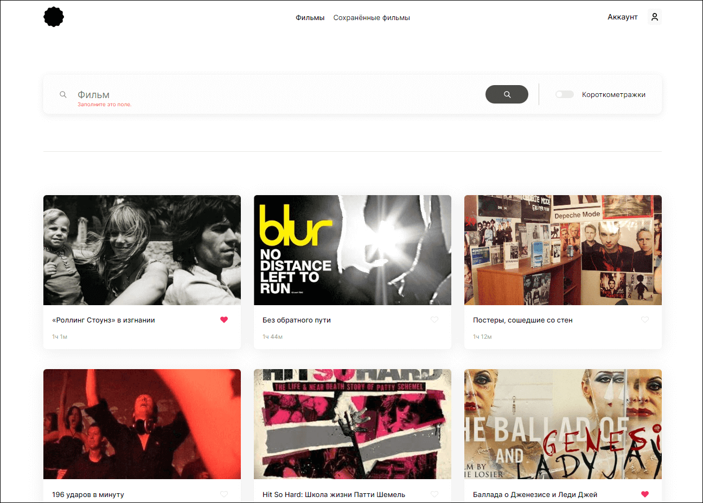
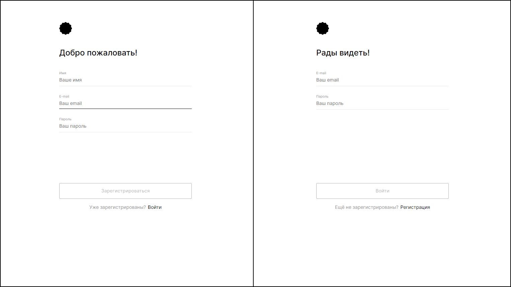

# movies-explorer-frontend
Frontend-часть дипломной работы

### О проекте

[`Movies-explorer`](https://movies.olerastova.nomoredomains.monster) - учебный, финальный проект на курсе веб-разработки Яндекс Практикум.

 `Вот что было сделано:`

- [x] Свёрстаны компоненты на React, разметка портирована в его формат;
- [x] Описана логика и вёрстка страниц регистрации, логина, редактирования профиля, сохранённых фильмов;
- [x] Проработаны авторизованные и неавторизованные состояния, сохранение фильмов в профиле;
- [x] Полученные фильмы фильтруются на стороне клиента;
- [x] Реализованы асинхронные GET- и POST-запросы к API;
- [x] Настроена инфраструктура и создан сервер на express;
- [x] Подключена база данных, созданы схемы и модели ресурсов API;
- [x] Реализовано логирование, аутентификация и авторизация на сервере;
- [x] Бэкенд задеплоен на Яндекс Облако.

`Инструменты и стек:`

- [x] HTML;
- [x] CSS;
- [x] React;
- [x] Express;
- [x] MongoDB;
- [x] NodeJS;
- [x] API;
- [x] Nginx;
- [x] JWT;
- [x] Postman.

 `Запуск проекта`

1. Клонировать репозиторий

    `git clone https://github.com/olesia1205/movies-explorer-frontend.git`

2. Установить зависимости

    `cd movies-explorer-frontend`

    `npm ci`

3. Для запуска использовать команды

    `npm run start`

    Запуск проекта в режиме разработки.
    Для просмотра результатов в браузере откройте http://localhost:3000
    После внесения изменений страница перезагрузится автоматически

    `npm run build`

    Создает финальную сборку проекта, готовую для развертывания, в папке `build`

***

##### Ссылка на фронтенд-часть приложения: https://movies.olerastova.nomoredomains.monster
